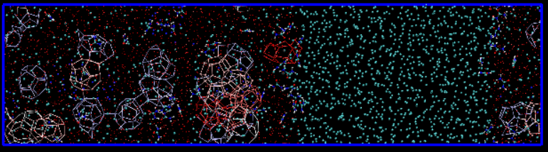

# TRACE - Topological Ring and Additive-Coordinated Cage Explorer

## Table of Contents

- [1. Introduction](#1-introduction)
- [2. Usage](#2-usage)
  - [2.1 Clone the repository](#21-clone-the-repository)
  - [2.2 Compile the program](#22-compile-the-program)
  - [2.3 Run TRACE](#23-run-trace)
  - [2.4 Visualization with VMD](#24-visualization-with-vmd)
- [3. File Format](#3-file-format)
  - [3.1 H2O file](#31-h2o-file)
  - [3.2 Guest file](#32-guest-file)
  - [3.3 Additive Hydrogen Bond Definition File](#33-additive-hydrogen-bond-definition-file)
- [4. Command Line Options](#4-command-line-options)
- [5. Output Files and Analysis](#5-output-files-and-analysis)
  - [5.1 cage.txt](#51-cagetxt)
  - [5.2 detail_cage.txt](#52-detail_cagetxt)
  - [5.3 visual.gro](#53-visualgro)
  - [5.4 visual_index.txt](#54-visual_indextxt)
  - [5.5 occupancy.txt](#55-occupancytxt)
  - [5.6 cluster.txt](#56-clustertxt)
  - [5.7 crystallinity.txt](#57-crystallinitytxt)
  - [5.8 ring.txt](#58-ringtxt)
  - [5.9 ring_detail.txt](#59-ring_detailtxt)
- [6. License](#6-license)
## 1. Introduction

TRACE (Topological Ring and Additive-Coordinated Cage Explorer) is a high-performance algorithm written in `C++`, developed to identify and classify hydrate cage structures from molecular dynamics (MD) simulations of clathrate hydrates. Designed to analyze GROMACS-format trajectories (`.gro`), TRACE provides comprehensive detection of structural motifs including rings, cups, incomplete cages, and complete cages—particularly those formed through additive–water interactions.

TRACE achieves both high accuracy and computational efficiency across a wide range of system sizes and topologies, from hundreds to millions of particles. Its key features include:

- Detection of complete cages and near-complete (incomplete) cages.
- Ring enumeration up to 12-membered rings (user-adjustable).
- Custom hydrogen bond definitions to identify additive-coordinated cages (currently supports one additive species, user-extensible).
- Automated identification of cage clusters.
- Full tracking of cage-forming water and additive molecules, enabling post-analysis of cage lifetime and additive residence time.
- Crystallinity estimation of the entire system.
- Guest molecule occupancy analysis for each cage.

This tool was developed as part of an academic study on hydrate formation dynamics.  
For more details, please see our manuscript [reference pending, currently under review at *Journal of Chemical Theory and Computation*].  

TRACE v1.0: Topological Ring and Additive-Coordinated Cage Explorer
Jun Wei Hsu, Shiang-Tai Lin
Computational Molecular Engineering Laboratory
Department of Chemical Engineering, National Taiwan University, Taipei, Taiwan

Corresponding author: Shiang-Tai Lin (stlin@ntu.edu.tw)  

## 2. Usage

### 2.1 Clone the repository

Clone the repository to your desired directory (replace `/path/to/TRACE` with your chosen path):

`git clone https://github.com/junweihsu/TRACE.git /path/to/TRACE`

### 2.2 Compile the program

Compile TRACE using `g++` with OpenMP support:

`g++ -fopenmp /path/to/TRACE/TRACE.cpp -o /path/to/TRACE/TRACE.exe`

- A C++ compiler supporting at least C++11 standard (e.g., g++ 4.8 or later).
- OpenMP support enabled (g++ 4.8 or later recommended).

### 2.3 Run TRACE

`cd /path/to/TRACE/example`

TRACE automatically adjusts computation based on the input files provided. Some example usages:

- Compute only water cages:

`/path/to/TRACE/TRACE.exe -w example_H2O.gro`

- Compute cages for water and guest molecules:

`/path/to/TRACE/TRACE.exe -w example_H2O.gro -g example_guest.gro`

- Compute cages for water, urea additives, and guests:

`/path/to/TRACE/TRACE.exe -w example_H2O.gro -g example_guest.gro -a example_urea.gro -h hbond_urea.txt`

> *Note: See [Section 3: File Format](#3-file-format) for details on file structure.*

> *Note We generate a total of 9 output files for analysis.*  
> *All output files are saved by default in the current working directory.* 
> *The output file names are fixed (non-randomized), so please be careful to avoid overwriting existing files.*

For detailed information, see Section 5. Output Files and Analysis.

### 2.4 Visualization with VMD

To visualize the results, you need to install VMD (Visual Molecular Dynamics).

Make sure you are already in the analysis output directory that contains `visual.gro` and `visual_index.txt`, and that the analysis has been completed.

Once installed and the analysis is complete, launch VMD from the terminal:

`vmd -e /path/to/TRACE/visualize.tcl`

> By default, the script [`visualize.tcl`](./visualize.tcl) assumes the required files are in the current working directory (`./`).



## 3. File Format

Water, guest molecules, and additives must be provided as separate `.gro` files.  
You can use GROMACS' `trjconv` and `make_ndx` tools to extract and create these separate index groups from your full system trajectory.

For details on the `.gro` file format used by TRACE, please refer to the official GROMACS documentation:  
[GROMACS 5.0.4 `.gro` file format](https://manual.gromacs.org/archive/5.0.4/online/gro.html)

Because the program does **not** require users to input the number of atoms per molecule (e.g., for H2O, guest, additive),  
it relies on **sequential and consistent (`resid`)** IDs  to identify molecule boundaries. This is the default behavior for GROMACS `.gro` output.

Be aware that errors may occur if the `.gro` file has been manually edited or converted from LAMMPS trajectories. In particular, note the unit differences: LAMMPS uses Ångström (Å), whereas GROMACS uses nanometers (nm).

For example:
| Correct format        | Correct format        | Wrong format          | Correct format        | Correct format        |
|-----------------------|-----------------------|-----------------------|-----------------------|-----------------------|
|    1H2O   OICE  ...   |    1H2O   OICE  ...   |    1H2O   OICE  ...   |    1CO2   C_EP  ...   |    1CO2   C_EP  ...   |
|    1H2O   HICE  ...   |    2H2O   OICE  ...   |    1H2O   HICE  ...   |    1CO2   O_EP  ...   |    2CO2   C_EP  ...   |
|    1H2O   HICE  ...   |    3H2O   OICE  ...   |    1H2O   HICE  ...   |    1CO2   O_EP  ...   |    3CO2   C_EP  ...   |
|    2H2O   OICE  ...   |    4H2O   OICE  ...   |    1H2O   OICE  ...   |    2CO2   C_EP  ...   |    4CO2   C_EP  ...   |
|    2H2O   HICE  ...   |    5H2O   OICE  ...   |    1H2O   HICE  ...   |    2CO2   O_EP  ...   |    5CO2   C_EP  ...   |
|    2H2O   HICE  ...   |    6H2O   OICE  ...   |    1H2O   HICE  ...   |    2CO2   O_EP  ...   |    6CO2   C_EP  ...   |
|    3H2O   OICE  ...   |    7H2O   OICE  ...   |    1H2O   OICE  ...   |    3CO2   C_EP  ...   |    7CO2   C_EP  ...   |
|    ...                |    ...                |    ...                |    ...                |    ...                |

> Improper formatting may cause TRACE to misidentify molecule boundaries or generate invalid results.

### 3.1 H2O file 

- The first atom must be **O** (oxygen).  
- If present, **H1** and **H2** atoms must immediately follow as the second and third atoms, respectively.  
- Supported water models:  
  - **O**       : 1-point water  
  - **OHH**     : 3-point water  
  - **OHHM**    : 4-point water  
  - **OHHLL**   : 5-point water
    
For example:
| Correct format       | Wrong format         | Wrong format         |
|----------------------|----------------------|----------------------|
|    1H2O   OICE ...   |    1H2O   HICE ...   |   1H2O   HICE ...    |
|    1H2O   HICE ...   |    1H2O   OICE ...   |   1H2O   HICE ...    |
|    1H2O   HICE ...   |    1H2O   HICE ...   |   1H2O   OICE ...    |

> *Note: Dummy atoms (if any) will be ignored.*
> *If hydrogen atoms (H1, H2) are present, hydrogen bonds and bond angles will be considered; otherwise, these features are disabled.*

### 3.2 Guest file 

- The guest molecule uses the **first atom as its center point**.  
- To include multiple guest molecule types (e.g., CO₂, CH₄), extract a single representative atom per molecule (such as the carbon atom for CO₂ and CH₄) to serve as the molecule’s center point.
- Use `make_ndx` to create index groups for each guest type, then use `trjconv` to extract these single-point representations and merge them into a single `.gro` file for processing by TRACE.

For more complex guest molecules that cannot be effectively represented by a single center point atom (e.g., urea or linear molecules like butane), an advanced approach is recommended:

-Break down each guest molecule into several atoms (e.g., 2 nitrogen atoms, 1 oxygen atom, and 1 carbon atom for urea; 4 carbon atoms for butane),  
  treating each atom as an individual “guest molecule” unit. This can be achieved by using `make_ndx` to select these atoms separately,  
  then extracting them with `trjconv` to produce a `.gro` file where one guest molecule corresponds to multiple independent atoms for TRACE analysis.

For example:
| example1              | example2              |
|-----------------------|-----------------------|
|    1CO2   C_EP  ...   |    1CO2   C_EP  ...   |
|    2CO2   C_EP  ...   |    2CO2   C_EP  ...   |
|    3CO2   C_EP  ...   |    3Urea    C1  ...   |   
|    4CO2   C_EP  ...   |    4Urea    O2  ...   |
|    5CH4    CT1  ...   |    5Urea    N3  ...   | 
|    6CH4    CT1  ...   |    6Urea    N4  ...   |
|    7CH4    CT1  ...   |    7Urea    C1  ...   |
|    8Urea    C1  ...   |    8Urea    O2  ...   | 
|    9Urea    C1  ...   |    9Urea    N3  ...   |
|   10Urea    C1  ...   |   10Urea    N4  ...   |
|     ...               |    ...                |    

> 💡 **Note:** In this advanced guest atom selection mode, each selected atom is treated as an individual guest unit.  
> Therefore, the guest indices reported in [Section 5.2: `detail_cage.txt`](#52-detail_cagetxt) correspond directly to the **input order in the `.gro` file**.  
> This allows users to backtrack from the guest index (in a given cage) to the specific atom — and thus, to the specific molecule and position — based on their `.gro` file structure.


### 3.3 Additive Hydrogen Bond Definition File

TRACE allows users to define custom hydrogen bonds between additive and water molecules by providing an external file via the `-h` option.

Each hydrogen bond entry must start with `!` and follow the format:
`! donor_type acceptor_type donor_atom_index acceptor_atom_index donor_H_atom_index theta_cutoff`
Where:
- `donor_type`, `acceptor_type`: either `w` (water) or `a` (additive)  
- `donor_atom_index`, `acceptor_atom_index`, and `donor_H_atom_index`: indices according to the `.gro` file  
- `theta_cutoff`: angular cutoff in degrees  
- The order of entries does not affect the outcome

Atom indices **must match the order in the `.gro` file**. For example, water must be ordered as `O H1 H2 ...`, and the additive atoms should follow their appearance in the file.  

For H₂O.gro example:
|---------------------------|
|    1H2O  OICE1    1 ...   | 
|    1H2O  HICE2    2 ...   | 
|    1H2O  HICE3    3 ...   |
|    2H2O  OICE1    4 ...   |
|    ...                    |

For urea.gro example:
|---------------------------|
|    1Urea    C1    1 ...   |  
|    1Urea    O2    2 ...   | 
|    1Urea    N3    3 ...   |
|    1Urea    N4    4 ...   |  
|    1Urea    H5    5 ...   | 
|    1Urea    H6    6 ...   |
|    1Urea    H7    7 ...   |  
|    1Urea    H8    8 ...   | 
|    2Urea    C1    9 ...   |
|    ...                    |

#### Sample content of `hbond_urea.txt`
<pre>
# water-additive interaction
! w a 0 1 1 35 #OICE1(0)-O2(1)-HICE2(1)
! w a 0 1 2 35 #OICE1(0)-O2(1)-HICE3(2)
! a w 2 0 4 35 #N3(2)-OICE1(0)-H5(4)
! a w 2 0 5 35 #N3(2)-OICE1(0)-H6(5)
! a w 3 0 6 35 #N4(3)-OICE1(0)-H7(6)
! a w 3 0 7 35 #N4(3)-OICE1(0)-H8(7)

# additive-additive interaction
! a a 2 1 4 35 #N3(2)-O2(1)-H5(4)
! a a 2 1 5 35 #N3(2)-O2(1)-H6(5)
! a a 3 1 6 35 #N4(3)-O2(1)-H7(6)
! a a 3 1 7 35 #N4(3)-O2(1)-H8(7)
</pre>

> 💡 **Note:** water–water hydrogen bonds are built-in and do not need to be listed.
You can refer to the provided [`hbond_urea.txt`](./example/hbond_urea.txt) file for a complete working example.

## 4. Command Line Options

TRACE accepts both **relative** and **absolute** file paths.  
Only the `-w` option is required; all others are optional.

### Required Parameter

| Option | Example     | Description         |
|--------|-------------|---------------------|
| `-w`   | `H2O.gro`   | Water `.gro` file   |

### Optional Parameters

| Option  | Example         | Description |
|---------|-----------------|-------------|
| `-g`    | `CO2.gro`       | Guest molecule `.gro` file |
| `-a`    | `add.gro`       | Additive molecule `.gro` file |
| `-h`    | `hbond.txt`     | Hydrogen bond definition file (see [3.3 Additive Hydrogen Bond Definition File](#33-additive-hydrogen-bond-definition-file)) |
| `-b`    | `0`             | Starting frame index (default: `0`) |
| `-e`    | `2000`          | Ending frame index |
| `-si`   | `10`            | Frame shift interval (default: `0`) |
| `-r`    | `0.36`          | H-bond O–O cutoff distance in nm (default: `0.36`) |
| `-th`   | `35`            | H-bond angle (O···O–H) threshold in degrees (default: `35`; use `< 0` to disable angle check) |
| `-DA`   | `90`            | Dihedral angle tolerance (default: `90°`) |
| `-IA`   | `20`            | Interior angle tolerance for rings ≥7 (default: `20°`; **Recommendation:** Keep below 25° to avoid missing cages. ) |
| `-mr`   | `10`             | Maximum ring size to detect (6–12; default: `10`) |
| `-cl`   | `yes` / `no`    | Include incomplete cages in cluster detection (default: `yes`) |
| `-nb`   | `4 4 4`         | Number of sub-boxes in `x y z` (default: box length / 1.2 nm, rounded) |
| `-nt`   | `8`             | Number of threads to use (default: `1`) |

## 5. Output Files and Analysis

TRACE generates **9 output files** in the current working directory.  
File names are fixed and will be overwritten if they already exist — please back up your results before rerunning.

| Filename               | Description |
|------------------------|-------------|
| `cage.txt`             | Summary of all cage types detected per frame. |
| `detail_cage.txt`      | Detailed topology and molecule membership for each cage. |
| `visual.gro`           | Structure file for visualizing cages in VMD. |
| `visual_index.txt`     | Cage-type index for coloring atoms in VMD [`visualize.tcl`](./visualize.tcl). |
| `occupancy.txt`        | Frame-by-frame guest molecule occupancy per cage. |
| `cluster.txt`          | Cage cluster statistics per frame. |
| `crystallinity.txt`    | Number of cages each molecule participates in per frame and average system crystallinity |
| `ring.txt`             | Number of 4-, 5-, and 6-membered rings each molecule participates in per frame. |
| `ring_detail.txt`      | Complete list of all individual rings detected and their constituent molecules. |

---

### 5.1 cage.txt

This file reports the number of each cage type per frame. Cage types follow the **standard edge-saturated cage (SEC)** notation (e.g., `4(1)5(10)6(2)` represents a cage made of 1 quadrilateral, 10 pentagons, and 2 hexagons).

Columns include:
- `SEC` : standard edge-saturated cages  
- `non-SEC` : nonstandard edge-saturated cages  
- `IC` : incomplete cages  
- `others` : all other non-listed `SEC` cage types  
- Detailed cage types (e.g., `1,10,2` = 1 quadrilateral, 10 pentagons, 2 hexagons)

---

### 5.2 detail_cage.txt

This file includes per-cage information such as topology, constituent molecules, spatial center, and cluster association.

Each frame includes a summary of the number of different ring sizes, cup and cage motifs it contains. For example:
```plaintext
Frame: 2
4r: 326
5r: 1489
6r: 1516
7r: 176
8r: 41
9r: 1
10r: 0
cup: 1557
SEC: 10
NSEC: 0
IC: 12
```
This indicates the total number of 4- to n-membered rings, cup and cage structures found across the trajectory.

Each cage includes a summary of its geometry properties. For example:

```plaintext
#cage 1 Type: 5(12)6(2) t: 72 F: 14 E: 36 V:24
 CP [ 2.062 1.146 6.043 ]
 V [ 8 97 107 318 453 602 669 752 853 1120 1122 1494 1660 1688 1982 2167 2238 2421 2514 2594 2718 2824 2936 2983 ]
 g [ 1444 ]
 a [ 3002: 0.630 3050: 0.688 3037: 1.031 ]
```

**Cage label symbols:**
- `#cage n`     : SEC  
- `@cage n`     : non-SEC  
- `!cage n`     : IC  
- `#a-cage n`   : additive-coordinated SEC  
- `@a-cage n`   : additive-coordinated non-SEC  
- `!a-cage n`   : additive-coordinated IC  
(n is the cluster ID, sorted from largest to smallest. Refer to cluster.txt for cluster composition and size.)

**Sections:**
- `F`, `E`, `V`: number of polygonal faces, edges, and vertices  
- `t`: theoretical number of vertices (assuming isolated faces)  
- `CP [x y z]`: geometric center of the cage  
- `V [ ... ]` lists indices (1 to Nw+Na) of water and additive molecules in the cage.
- `g [ ... ]` lists guest molecule indices (1 to Ng) occupying the cage.
- `a [ ... ]` lists up to 3 additives closest to the cage center, formatted as: add_index:distance (nm).

Note:  
- `Nw` = number of water molecules  
- `Ng` = number of guest molecules  
- `Na` = number of additive molecules  

Water molecule indices range from `1` to `Nw`,  
while additive molecule indices range from `Nw + 1` to `Nw + Na`.)

> Although .gro files wrap residue IDs and atom numbers beyond 99999 due to fixed-width formatting, TRACE internally assigns unique sequential molecule indices based on input order. This ensures that each water, guest, and additive molecule has a unique and consistent identifier throughout the analysis.  
> All indices refer to the **input sequence order**, not `.gro` residue IDs.

### 5.3 visual.gro

Generates a `.gro` file for visualization in VMD.

### 5.4 visual_index.txt

Generates an index file used for coloring in VMD.

For usage details, please refer to [2.4 Visualization with VMD](#24-visualization-with-vmd) with VMD.

### 5.5 occupancy.txt

This file records the total number of hydrate cages per frame (including SEC, non-SEC, and IC cages) and the number of cages occupied by guest molecules. It also reports the occupancy rate (`occ`), which can be calculated for all cages, SECs, non-SECs, or ICs.

For example, the overall occupancy rate is calculated as:

    occ(ALL) = ALL_F / ALL

where:
- `ALL` = total number of all cages in the frame
- `ALL_F` = number of cages currently occupied by guest molecules

### 5.6 cluster.txt

This file records cage clusters for each frame, sorted from largest to smallest cluster size.

Format example:

#Frame cluster 1 (size) ... cluster n (size)

0 11 4 3 2 1 1

1 13 4 2 2 1 1 1 1 1

2 13 6 6 1 1 1 1

...

- Each number after the frame index represents the size of a cage cluster.
- Cage clusters are defined by cages sharing polygonal faces and grouped as one cluster.
- To identify the specific cage types belonging to each cluster, please refer to the corresponding frame section in [Section 5.2 detail_cage.txt](#52-detail_cagetxt), which provides detailed cage topology and membership information.

### 5.7 crystallinity.txt

Records how many cages (SECs + non-SECs + IC) each molecule (water or additive) participates in per frame, along with the crystallinity index.

Example format:

#frame 1H2O ... nH2O ... nadd Crystallinity

1 4 3 4 ... 4 3.750

2 4 4 4 ... 4 4.000

...

- `1:H2O ... Nw:H2O`: indices of water molecules from 1 to Nw  
- `Na:add`: additive molecule indices from Nw+1 to Nw+Na 
- `Crystallinity`: average number of cages each molecule participates in

### 5.8 ring.txt

Records how many 4-, 5-, and 6-membered rings each molecule (water or additive) participates in per frame.

Example format:

#frame 1:H2O ... Nw:H2O ... Na:add 

1 2,4,5 1,0,6 ... 4,0,0

2 4,5,2 2,1,2 ... 3,2,3

...

-4r,5r,6r per molecule (from 1 to Nw + Na)

### 5.9 ring_detail.txt

Records the molecular composition of each ring in each frame. Molecule indices range from `1` to `Nw + Na` (water and additive molecules).

Each line corresponds to one ring:
```plaintext
[ 1 167 178 181 297 ]
```
This means the ring is formed by molecules with indices `1, 167, 178, 181, 297`, connected by hydrogen bonds in the following sequence:

1–167, 167–178, 178–181, 181–297, 297–1

- Each ring is assumed to form a closed loop based on hydrogen bonding order.
  
## 6. License
TRACE is free software: you can redistribute it and/or modify  
it under the terms of the GNU General Public License as published  
by the Free Software Foundation, either version 3 of the License,  
or (at your option) any later version.

TRACE is distributed in the hope that it will be useful,  
but WITHOUT ANY WARRANTY; without even the implied warranty of  
MERCHANTABILITY or FITNESS FOR A PARTICULAR PURPOSE. See the  
GNU General Public License for more details.

You should have received a copy of the GNU General Public License  
along with TRACE. If not, see [https://www.gnu.org/licenses/](https://www.gnu.org/licenses/).
